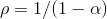
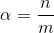
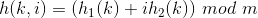
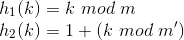

<h1>Open-Addressed Hashtable!</h1>

This API presents a C library that implements an open addressed hash table.
  In this type of hash table, data is stored in the table itself (as opposed to
  a <a href="https://github.com/AmateurECE/Chained-Hash">Chained Hashtable</a>,
  which stores the data in a
  <a href="https://github.com/AmateurECE/Singly-Linked-List">Linked List</a> or
  similar data structure). This means that the table needs to implement another
  way to handle or resolve collisions.

<h2>Collision Resolution</h2>

An open addressed hash table handles collisions by placing data into adjacent
  unoccupied locations in the table found by querying, or <i>probing</i>, until
  a suitable location is found. Due to this caveat, more consideration must be
  taken when implementing the hashing function. Two main methods are proposed to
  account for this, explained below. Assuming uniform hashing is accurately
  represented, the number of positions we can expect to probe for any given
  collision is represented by:

Where rho represents the number of positions and alpha is the load factor of
  the table, represented by:

Where n is the number of occupied locations in the table and m is the total
  size of the table.

<h2>Linear Probing</h2>

Linear probing refers to a method of probing whereby subsequent locations in
  the table are probed until an unoccupied location is found. This is fast,
  easily implemented, and easy on the eyes. However, if extensive collisions
  occur, it can easily lead to crowding and uneven distribution of elements,
  greatly increasing the number of positions that are probed per collision.
  Below is a table approximating the number of locations probed when a collision
  occurs corresponding to the current load factor of the table.

<table border="1" style="float: left;">
  <tr>
    <th>Load Factor (%)</th>
    <th>Expected Number of Probes</th>
  </tr>
  <tr>
    <td>&lt;50</td>
    <td>1/(1-0.50) &lt 2</td>
  </tr>
  <tr>
    <td>80</td>
    <td>1/(1-0.80) = 5</td>
  </tr>
  <tr>
    <td>90</td>
    <td>1/(1-0.90) = 10</td>
  </tr>
  <tr>
    <td>95</td>
    <td>1/(1-0.95) = 20</td>
  </tr>
</table>

As you can see, this type of loading has potential to greatly decrease the
  efficiency of the insertion algorithm. Still, however, it has use in some
  applications.

<h2>Double Hashing</h2>

This implementation uses double hashing, an approach that provides even
  distribution of elements even when a great number of collisions happen. This
  kind of probing, however, places some greater restrictions on the hash
  function. Shown below is the general description of the hash function used
  in this implementation.

The functions h1 and h2 are auxiliary functions, provided by the user in this
  implementation. Here, i represents the number of times the table has been
  probed thus far, and is given a value between 0 and m-1, so that it can be
  no greater than the total size of the table minus one. In order for this to
  ensure that all locations are visited before any one location is visited
  twice, however, m must be a power of 2, and the function h2 must always return
  an odd value, or m must be prime, and h2 must be selected so that it always
  returns a positive integer less than m. A typical example of this is shown
  below.

In the above equations, m' is slightly less than m, for example, m - 1 or
  m - 2.

The advantage of this kind of probing is that it produces a nice even
  distribution of elements when collisions occur, however it places strict
  constraints on how hashing functions can be chosen.

<h2>Building the source</h2>

This program can be downloaded from git using the normal routine, and built
  using the standard autotools procedure:
  <code>
     ./configure && make && make install
  </code>
   Don't forget to use <code>sudo</code> if you do not have administrative
  privileges!

<h3>Sources</h3>
   <cite>CodeCogs Equation Editor</cite>
  <a href="http://www.homeschoolmath.net/worksheets/equation_editor.php">
    http://www.homeschoolmath.net/worksheets/equation_editor.php</a>
   <cite>Mastering Algorithms With C</cite>, Kyle Loudon.&copy;1999,
  O'Reilly Media & Associates, Inc

  
